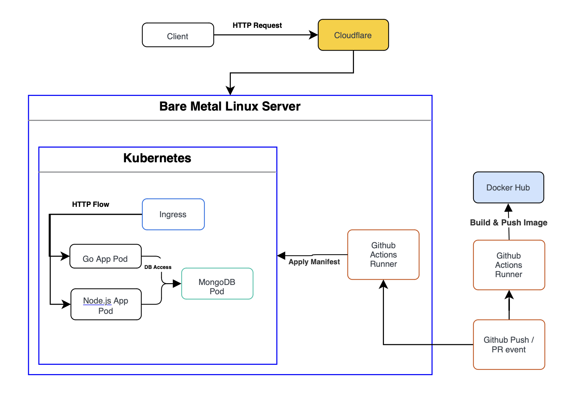
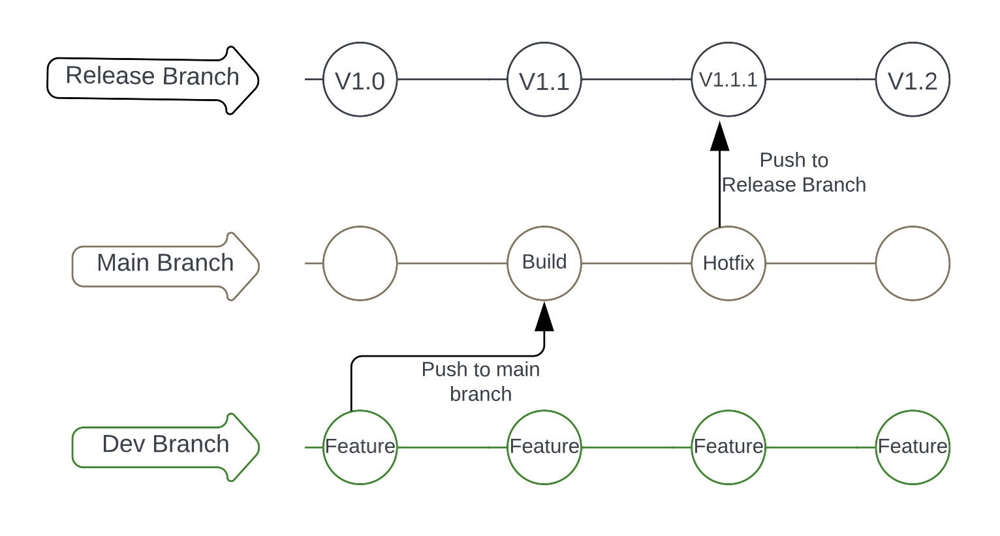

# CICD_Example

## Requirements
- Create an app using golang
- Create an app using Node.js
- Build the services
- Test the services
- Build the container image
- Store the image in a registry
- Deploy to k8s cluster
- Expose services to public internet using any DNS domain

## Tech Stack used
### Golang App
The Golang app will be a simple CRUD API that will serve the management & viewing of User data. The User data will consist of a name & description. The app will use gin framework for serving HTTP requests, mongo library for connecting to the mongoDB, strechr for quick test assertion.

### Node.js App
The Node.js app will be a simple CRUD API that will serve the management & viewing of User Blogging data. The Blog data will consist of a user_id, timestamp & content. The app will use express.js framework for serving HTTP requests, mongo library for connecting to the mongoDB, jest for unit testing.

### Image Building & Storing
The images are built using the dockerfiles that are in each of the app folder, the image will use the go 1.20 & node 20 images as base image. The image will be publicly stored in Docker Hub registry under oksidiantafly/go-app and oksidiantafly/node-app.

### Kubernetes Deployment
The K8S cluster is deployed in a local bare metal Linux server that has access to a static IP, the cluster is built using K3S setup tool and will be using Nginx Ingress controller to proxy its HTTP traffic.

### Others
The app will be publicly available in the internet using an owned domain name (oksidian.com) that is linked to the already established static IP. The CI/CD of the app is done by a combination of self-hosted & cloud Github Actions runners.

Structure Diagram:

## CI/CD Workflow
The CI/CD will implement a trunk based development workflow in which building & testing the app is done on main branch push / PR event triggers. The image is then built, pushed, and deployed when the main branch is pushed into a release branch (this is called a release event). The separation of main & release branch will help support quick hotfixes in the main branch.

Gitflow Diagram:

